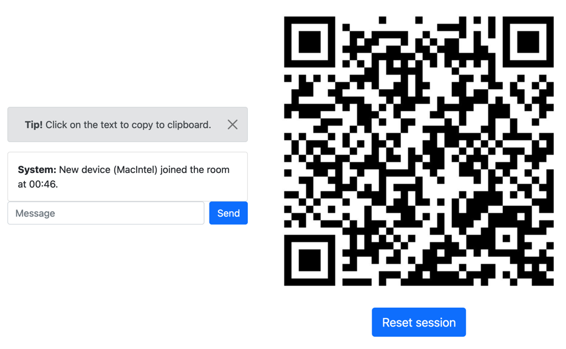

# Quickshare

Share text quickly between devices.

### What is this?

If you enter the root path, you will be redirected to a random generated session which will show you
a qr-code with the current url inside, that can be used by other devices to join the session.
Every client on the same url can read the messages each client sends to the chat.

___
### Additional information

Of course the messages are not really secret, because one could guess the url and join the session
like this, but the session id contains 36 ascii characters, so that is not very likely. Everyone can
decide for themselves what kind of messages one will send via this tool.

Everything runs on memory, nothing is stored on disk.

Highly WIP.